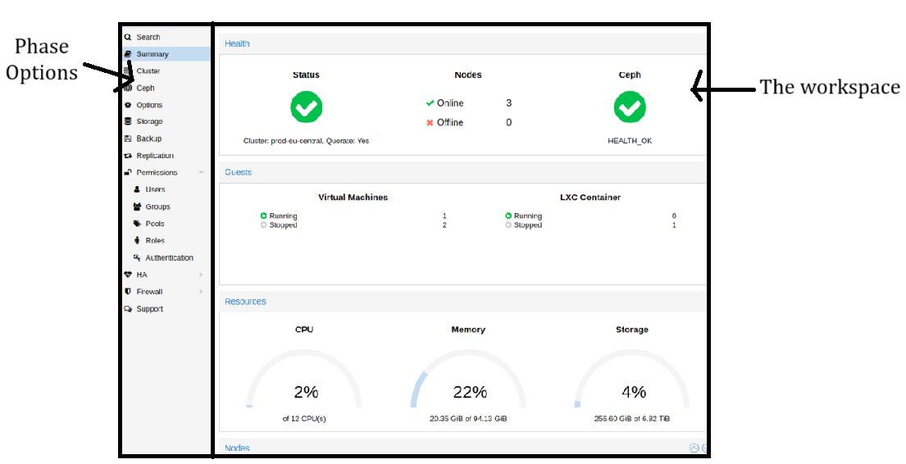

# 2024 Ground Station

This repository contains the codebase for the **Ground Station Interface**, which includes the graphical user interface (GUI) for user interaction and the **Ground API** used by the CubeSat for sending data to the ground station.

## General Design

The ground station serves as a central hub for monitoring, controlling, and logging CubeSat operations. Its features are divided across operational phases as follows:

### **Phase 1**

- **Comms Link Monitoring**:
  - Display the status of the communication link.
  - Provide basic troubleshooting tools for simple issues.
- **Health Check**:
  - Command the CubeSat to perform a detailed health check.
  - Display health check data to the user and log it for future reference.

### **Phase 2**

- **Stage Initiation**:
  - Begin the phase by supplying the CubeSat with the target number series to detect.
- **Detection Monitoring**:
  - Display image updates showing the CubeSat’s identification results.
  - Provide an option for manual override of automatic detection processes.

### **Phase 3**

- **Stage and Sub-Phase Control**:
  - Initiate this phase and its sub-phases manually if not automated.
- **Dock Detection**:
  - Display real-time image frames to verify dock detection and alignment.
  - Allow the user to retry alignment if necessary.
- **Damage Assessment** (Sub-Phase 2):
  - Show and store images for manual identification and assessment of damage.
- **Live Feed** (Sub-Phase 3):
  - Provide a live feed, if possible, to enhance situational awareness.

## API Details

The **Ground API** facilitates communication between the CubeSat and the ground station, supporting the following:

### **Satellite-to-Ground Communication**

- **Data Transmission**:
  - The CubeSat sends telemetry, health reports, and image data to the ground station for display and storage.
- **Event Logging**:
  - Logs events, such as phase completions and detected anomalies, for future analysis.

### **Error Handling**

- Implements fail-safe mechanisms for both sending and receiving data, ensuring robust communication between the ground station and CubeSat.

## Design Inspiration

The design takes inspiration from **Proxmox’s Interface**, focusing on simplicity and functionality. Although the use cases differ, the shared goal is system management. The GUI provides a streamlined workflow for monitoring, controlling, and troubleshooting the CubeSat.

